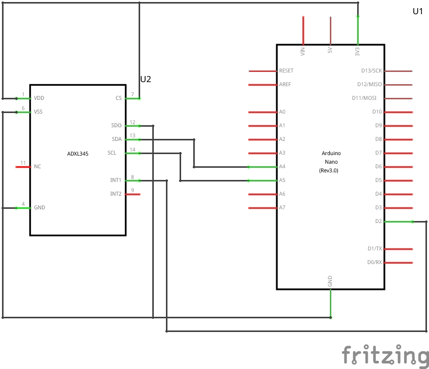

# egcp-2120-lightsaber
DIY lightsaber built from scratch with an ATmega328P, using the PlatformIO VSCode extension development environment and Fritzing to generate the wiring diagram. The overal goal for the code of this project is to write everything without the use of any helper libraries, rather only the base AVR libraries (for registers, interrupts, and delays).

## Schematic

## Datasheets
ATmega328P - [https://ww1.microchip.com/downloads/aemDocuments/documents/MCU08/ProductDocuments/DataSheets/Atmel-7810-Automotive-Microcontrollers-ATmega328P_Datasheet.pdf](https://ww1.microchip.com/downloads/aemDocuments/documents/MCU08/ProductDocuments/DataSheets/Atmel-7810-Automotive-Microcontrollers-ATmega328P_Datasheet.pdf)  
ADXL345 - [https://www.analog.com/media/en/technical-documentation/data-sheets/ADXL345.pdf](https://www.analog.com/media/en/technical-documentation/data-sheets/ADXL345.pdf)
